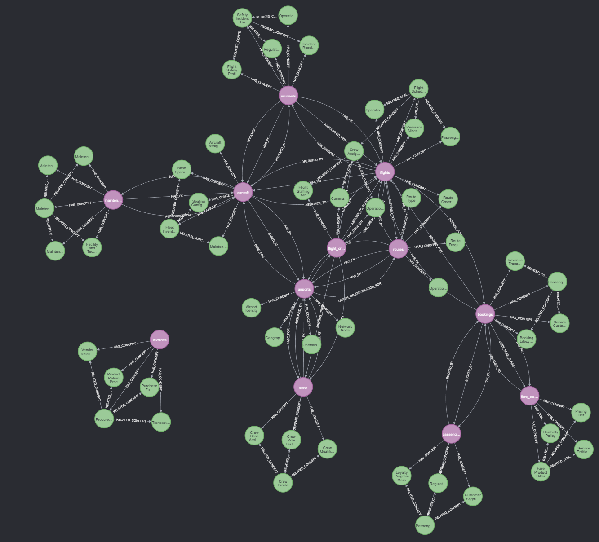
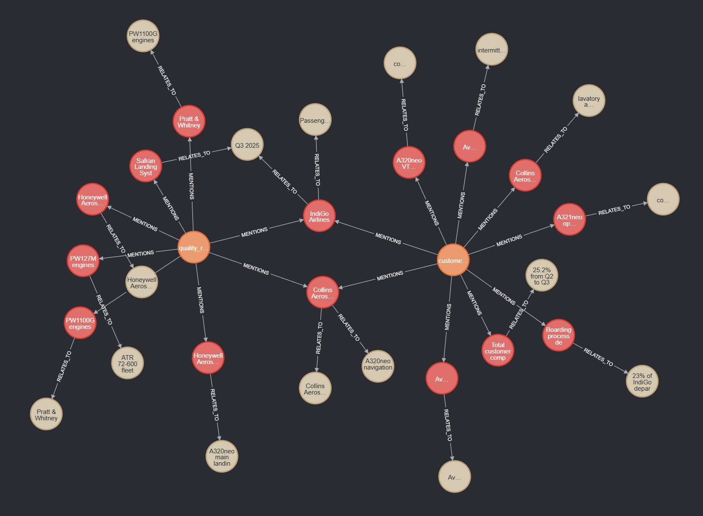
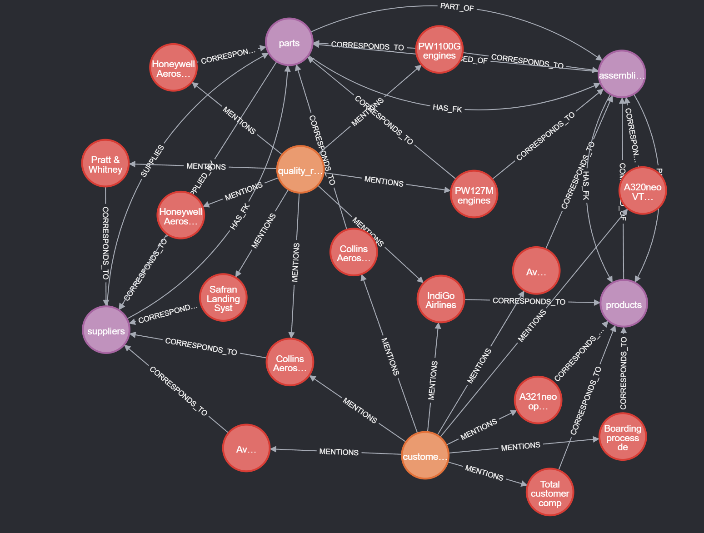

# Knowledge Graph Ontology — Semantic Layer for IndiGo Airlines

A 3-layer Knowledge Graph (KG) ontology that acts as a **semantic layer** over structured (SQL) and unstructured (text) data sources. The KG is not a replica of the data — it is a *map of the data landscape* that helps agents understand what exists, where it lives, and how entities relate to each other.

> **Analogy:** The KG is a map of a city. The map doesn't contain the buildings — it tells you where they are, what category they belong to, and how to navigate between them.

---

## Architecture

```
Unstructured Sources          Structured Sources         Structured Sources
       │                              │                         │
       ▼                              ▼                         │
 [Lexical Graph]              [Domain Graph]          ← Layer 1 ✅
       │                              ▲                         │
       │   MENTIONS                   │ CORRESPONDS_TO          │
       ▼                              │                         │
 [Subject Graph] ──────────────────────                         │
                                                                │
                    ┌───────────────────────────────────────────┘
                    │
              [Inference Agent]  ← Layer 4 ✅
              graph_ontology_tool  │  vector_search_tool  │  sql_query_tool
              (Cosmos DB Gremlin)  │  (Cosmos DB NoSQL)   │  (SQLite)
```

| Layer | Source | What it captures | Status |
|---|---|---|---|
| **Layer 1 — Domain Graph** | SQLite DB | Schema semantics: table descriptions, domains, FK + semantic relationships + abstract Concept nodes (cross-table normalized) | ✅ Complete |
| **Layer 2 — Lexical Graph** | Text files | Document landscape: Document → Subject → Object (SPO triplets) + vector embeddings | ✅ Complete |
| **Layer 3 — Subject Graph** | Cross-layer | Bridge: `CORRESPONDS_TO` edges linking unstructured subjects to structured entities | ✅ Complete |
| **Inference Agent** | All layers | ReAct agent that navigates the KG + vector DB + SQL to answer questions | ✅ Complete |

---

## Project Structure

```
KG_ontology_generation/
│
├── agents/                          # ReAct agent classes and tools (one file per layer)
│   ├── __init__.py
│   ├── domain_agent.py              # Layer 1 agent: SQLDBQueryTool + EnrichmentAgent + enrich_with_llm_advanced
│   ├── lexical_agent.py             # Layer 2 agent: VectorDBQueryTool + LexicalEnrichmentAgent + extract_spo_triplets_advanced
│   ├── subject_agent.py             # Layer 3 agent: GraphQueryTool + ResolutionAgent + resolve_correspondences_advanced
│   └── inference_agent.py           # Inference agent: GraphOntologyTool + VectorSearchTool + SQLQueryTool + InferenceAgent
│
├── source_data_files/               # Raw source data (CSVs, text files, PDFs)
│   ├── aircraft.csv                 # Aircraft fleet with registrations, models, capacity
│   ├── airports.csv                 # Airport metadata (IATA/ICAO codes, coordinates)
│   ├── passengers.csv               # Passenger profiles and frequent-flyer info
│   ├── crew.csv                     # Crew members with roles and qualifications
│   ├── fare_classes.csv             # Fare class definitions and perks
│   ├── routes.csv                   # Route network (origin/destination, distance)
│   ├── flights.csv                  # Flight schedule and actuals
│   ├── bookings.csv                 # Passenger bookings with fare and seat info
│   ├── flight_crew_assignments.csv  # Crew-to-flight assignments
│   ├── incidents.csv                # Safety and operational incidents
│   ├── maintenance.csv              # Maintenance records per aircraft
│   ├── maintenance_incidents.txt    # Unstructured: maintenance incident narratives
│   ├── operational_report.txt       # Unstructured: operational review report
│   └── Invoice_1.pdf               # Sample PDF invoice (extracted via GPT-4.1 vision)
│
├── source_data/                     # Generated data (created by setup_new_db.py)
│   ├── setup_new_db.py              # Creates airlines.db from CSVs + extracts PDF invoices
│   ├── airlines.db                  # SQLite DB (auto-created): 12 tables from CSVs + invoices
│   ├── maintenance_incidents.txt    # Copied from source_data_files/ by setup script
│   ├── operational_report.txt       # Copied from source_data_files/ by setup script
│   └── setup_vector_db.py            # Provisions Cosmos DB vector container + ingests embedded chunks
│
├── src/                             # Pipeline execution code
│   ├── __init__.py
│   ├── test_inference.py            # Test harness: 3 built-in questions + custom query + trace saving
│   ├── app.py                       # Flask web UI with SSE streaming for real-time agent steps
│   │
│   ├── utils/                       # Shared utilities (DRY)
│   │   ├── __init__.py
│   │   ├── llm.py                   # Azure OpenAI LLM + embedding client helpers
│   │   ├── cosmos_helpers.py        # Cosmos DB Gremlin client, read/write helpers, esc(), make_vertex_id(), gval()
│   │   ├── cosmos_vector_helpers.py # Cosmos DB NoSQL vector search operations (search, retrieve, upsert)
│   │   ├── neo4j_helpers.py         # Legacy Neo4j helpers (no longer imported — kept for reference)
│   │   └── pdf_extractor.py         # PDF → JSON extraction via Azure OpenAI GPT-4.1 vision
│   │
│   ├── domain_graph/                # Layer 1 — Domain Graph (structured data)
│   │   ├── __init__.py
│   │   └── domain_graph.py          # Full pipeline: introspect → enrich → normalize concepts → build → query
│   │
│   ├── lexical_graph/               # Layer 2 — Lexical Graph (unstructured data)
│   │   ├── __init__.py
│   │   └── lexical_graph.py         # Full pipeline: load → chunk → embed → extract → build → query
│   │
│   ├── subject_graph/               # Layer 3 — Subject Graph Bridge (cross-layer)
│   │   ├── __init__.py
│   │   └── subject_graph.py         # Full pipeline: fetch → embed → resolve → build → query → visualize
│   │
│   └── templates/
│       └── index.html               # Dark-themed web UI for the inference agent
│
├── requirements.txt                # Python dependencies
└── README.md                       # This file
```

---

## Prerequisites

### 1. Python Environment

```bash
python -m venv .venv

# Windows
.venv\Scripts\activate

# macOS/Linux
source .venv/bin/activate

pip install -r requirements.txt
```

### 2. Azure Cosmos DB (Gremlin API)

The graph database is hosted on Azure Cosmos DB. The account (`cosmosdb-gremlin-abpatra`) already exists. Run the following Azure CLI commands to create the database and graph container programmatically:

```bash
# 1. Create the database
az cosmosdb gremlin database create \
  --account-name cosmosdb-gremlin-abpatra \
  --resource-group rg-abpatra-7946 \
  --name indigokg \
  -o table

# 2. Create the graph container with partition key /category
#    MSYS_NO_PATHCONV=1 prevents Git Bash from mangling the path on Windows
MSYS_NO_PATHCONV=1 az cosmosdb gremlin graph create \
  --account-name cosmosdb-gremlin-abpatra \
  --resource-group rg-abpatra-7946 \
  --database-name indigokg \
  --name knowledgegraph \
  --partition-key-path "/category" \
  --throughput 400 \
  -o table
```

| Flag | Purpose |
|---|---|
| `--database-name indigokg` | Logical namespace grouping all 3 KG layers |
| `--name knowledgegraph` | Single container for Domain + Lexical + Subject graphs (cross-layer edges require co-location) |
| `--partition-key-path "/category"` | Vertices use `category='domain'` (DomainEntity/Concept) or `category='lexical'` (Document/Subject/Object) |
| `--throughput 400` | Minimum 400 RU/s — sufficient for development; scale up for production |

> **Windows note:** The `MSYS_NO_PATHCONV=1` prefix is required when using Git Bash. Without it, Git Bash converts `/category` into a Windows file path (`C:/Program Files/Git/category`) which Cosmos DB rejects. Not needed in PowerShell or WSL.

To retrieve the primary key programmatically:

```bash
az cosmosdb keys list \
  --name cosmosdb-gremlin-abpatra \
  --resource-group rg-abpatra-7946 \
  --query "primaryKey" -o tsv
```

Or from the **Azure Portal**: navigate to your Cosmos DB account → **Settings** → **Keys** → copy **PRIMARY KEY**.

Configure your `.env` file in the project root:

```
COSMOS_DB_ENDPOINT=cosmosdb-gremlin-abpatra.gremlin.cosmos.azure.com
COSMOS_DB_KEY=<your-primary-key>
```

- **Gremlin endpoint:** `wss://cosmosdb-gremlin-abpatra.gremlin.cosmos.azure.com:443/`
- **Database:** `indigokg`
- **Graph container:** `knowledgegraph`

### 3. Azure OpenAI

The project uses **Azure OpenAI GPT-4.1** via `DefaultAzureCredential` (your `az login` session). No API keys in code.

> **Important:** Update the constants at the top of `src/utils/llm.py` (`LLM_ENDPOINT`, `EMBEDDING_ENDPOINT`, `API_VERSION`, `LLM_MODEL`, etc.) to match your own Azure OpenAI resource endpoints and model deployments.

```bash
az login
```

### 4. Sample Data

Raw source files (CSVs, `.txt` files, PDFs) live in `source_data_files/`. Run the setup script to create the SQLite database, extract PDF invoices, and copy text files into the working directory:

```bash
python source_data/setup_new_db.py
```

This does three things:
1. **Creates `source_data/airlines.db`** — loads all CSVs from `source_data_files/` into 11 relational tables plus an `invoices` table
2. **Extracts PDF invoices** — if any `.pdf` files exist in `source_data_files/`, runs GPT-4.1 vision extraction (via `utils/pdf_extractor.py`) and loads the structured JSON into the `invoices` table
3. **Copies `.txt` files** — copies unstructured text files from `source_data_files/` into `source_data/` for Layer 2 processing

| Table | Description |
|---|---|
| `airports` | Airport metadata (IATA/ICAO codes, coordinates, timezone) |
| `aircraft` | Fleet aircraft with registration, model, capacity, status |
| `passengers` | Passenger profiles, frequent-flyer tiers |
| `crew` | Crew members with roles, qualifications, base airport |
| `fare_classes` | Fare class definitions (pricing, flexibility, perks) |
| `routes` | Route network (origin → destination, distance, frequency) |
| `flights` | Flight schedule, actuals, delays, gate/terminal |
| `bookings` | Passenger bookings linked to flights and fare classes |
| `flight_crew_assignments` | Crew-to-flight role assignments |
| `incidents` | Safety/operational incidents linked to flights and aircraft |
| `maintenance` | Maintenance records per aircraft (type, cost, findings) |
| `invoices` | PDF-extracted invoice data (products, returns, signatures as JSON) |

Key FK chains:
- `routes → airports` (origin + destination)
- `flights → routes, aircraft`
- `bookings → passengers, flights, fare_classes`
- `flight_crew_assignments → flights, crew`
- `incidents → flights, aircraft`
- `maintenance → aircraft`

### 5. Vector DB Setup

After creating the SQLite database and copying text files, provision the Cosmos DB NoSQL vector store and populate it with embedded document chunks:

```bash
python source_data/setup_vector_db.py
```

This script:
1. **Provisions Cosmos DB** — creates the `lexical_vector_db` database and `lexical_chunks` container with vector index policy (idempotent — skips if already exists)
2. **Chunks documents** — loads `.txt` files from `source_data/` and splits them into sections using the same section-based chunker as `lexical_graph.py`
3. **Generates embeddings** — embeds all chunks via Azure OpenAI `text-embedding-3-small` (1536 dimensions)
4. **Upserts to Cosmos DB** — stores all chunks with embeddings into the container, ready for vector similarity search

| Setting | Value |
|---|---|
| Endpoint | `https://cosmosdb-vectors.documents.azure.com:443/` |
| Database | `lexical_vector_db` |
| Container | `lexical_chunks` |
| Partition key | `/doc_name` |
| Vector index | `quantizedFlat` on `/embedding` (1536 dims, cosine) |

---

## Usage

### Layer 1 — Domain Graph

**Single-shot enrichment** (one LLM call per table):
```bash
python src/domain_graph/domain_graph.py
```

**ReAct agent enrichment** (iterative DB exploration per table):
```bash
python src/domain_graph/domain_graph.py --advanced
```

#### What the pipeline does:

1. **Introspect** — reads SQLite schema (tables, columns, PKs, FKs, row counts)
2. **Enrich** — LLM generates descriptions, domain labels, semantic relationships, and 2-5 abstract **concepts** per table (e.g., "Aircraft Component", "Supplier Relationship")
3. **Normalize Concepts** — LLM-based cross-table concept resolution: identifies merge groups (same concept from different tables, e.g., "Vendor Management" from parts + "Supplier Relationship" from suppliers), merges to canonical names, and detects cross-links between distinct but related concepts
4. **Build** — creates `DomainEntity` vertices, `Concept` vertices, relationship edges (`HAS_FK`, semantic, `HAS_CONCEPT`, `RELATED_CONCEPT`) in Cosmos DB Gremlin
5. **Query** — keyword-based search over both DomainEntity and Concept vertices for agent routing
6. **Visualize** — prints the full graph (DomainEntity vertices, Concept vertices, all edge types)

#### Cosmos DB Schema (Layer 1):

```
(DomainEntity {id, name, description, domain, key_columns, column_info, row_count, category='domain'})
    -[HAS_FK {reason}]->
(DomainEntity)

(DomainEntity)
    -[HAS_CONCEPT {derived_from}]->
(Concept {id, name, description, source_tables, derived_from, shared, category='domain'})

(Concept)
    -[RELATED_CONCEPT {relationship_type, reason}]->
(Concept)
```

- **Concept nodes** represent abstract business ideas derived from table columns (not raw data values).
- A concept with `shared: true` is linked via `HAS_CONCEPT` from multiple DomainEntity nodes — these are cross-table concepts that interlink otherwise separate tables.
- `RELATED_CONCEPT` edges capture semantic relationships between distinct concepts (e.g., "Aircraft Component" → COMPOSED_OF → "Assembly Structure").
- Concept normalization mirrors the entity resolution pattern from Layer 2: LLM-based merge groups with canonical names.

#### Graph Visualization



#### Sample Gremlin queries (Layer 1):

```groovy
// All DomainEntity vertices with their concepts
g.V().hasLabel('DomainEntity').as('d')
  .out('HAS_CONCEPT').as('c')
  .select('d','c').by('name').by(valueMap('name','description'))

// Shared concepts (cross-table)
g.V().hasLabel('Concept').has('shared', true).as('c')
  .in('HAS_CONCEPT').as('d')
  .select('c','d').by(valueMap('name','description')).by('name')

// Concept cross-links
g.E().hasLabel('RELATED_CONCEPT')
  .project('from','rel_type','to','reason')
  .by(outV().values('name'))
  .by('relationship_type')
  .by(inV().values('name'))
  .by('reason')

// All Layer 1 vertices (entities + concepts)
g.V().has('category','domain').valueMap(true)
```

---

### Layer 2 — Lexical Graph

**Single-shot extraction** (one LLM call per chunk):
```bash
python src/lexical_graph/lexical_graph.py
```

**ReAct agent extraction** (iterative vector DB exploration per document):
```bash
python src/lexical_graph/lexical_graph.py --advanced
```

#### What the pipeline does:

1. **Load** — scans `source_data/` for `.txt` files
2. **Chunk** — splits documents into sections using header/underline detection (fallback: paragraph splitting)
3. **Connect to Vector Store** — connects to the Cosmos DB NoSQL vector store (chunks are pre-populated by `setup_vector_db.py`)
4. **Extract SPO Triplets** — LLM extracts one **Subject-Predicate-Object** triplet per chunk (e.g., `Collins Aerospace smoke detector → reported_issue → false alarm during ground testing`)
5. **Entity Resolution** — LLM-based cross-document entity resolution: identifies merge groups (same entity, different names) and implicit mentions (parent entity implied by product name), renames to canonical forms
6. **Deduplicate** — merges SPO triplets by canonical subject name, accumulating multiple predicate-object contexts per subject
7. **Summarize** — generates 1-2 sentence summaries for each document
8. **Build Graph** — creates `Document`, `Subject`, and `Object` vertices with `MENTIONS` and `RELATES_TO` edges in Cosmos DB Gremlin (Chunk vertices are **not** stored in the graph — chunks are used internally for LLM context management and vector search only)
9. **Query** — dual query interface: keyword graph traversal + vector similarity search via Cosmos DB NoSQL

#### Cosmos DB Schema (Layer 2):

```
(Document {id, name, source_path, topic_summary, category='lexical'})
    -[MENTIONS {context}]->
(Subject {id, name, type, description, mention_count, category='lexical'})
    -[RELATES_TO {predicate}]->
(Object {id, name, category='lexical'})
```

The SPO model captures **what** each subject does/has/causes, not just that it exists. A single Subject can fan out to multiple Object nodes via different predicates — e.g., `Collins Aerospace → supplies → smoke detectors` and `Collins Aerospace → reported_issue → false alarm`.

#### Graph Visualization



#### Sample Gremlin queries (Layer 2):

```groovy
// All subjects from a document with their relations
g.V().hasLabel('Document').has('name','quality_reviews.txt')
  .out('MENTIONS').as('s')
  .project('name','type','predicate','object')
  .by('name').by('type')
  .by(outE('RELATES_TO').values('predicate').fold())
  .by(out('RELATES_TO').values('name').fold())

// What does a specific subject relate to?
g.V().hasLabel('Subject').has('name','Collins Aerospace')
  .outE('RELATES_TO').project('predicate','object')
  .by('predicate').by(inV().values('name'))

// Supplier entities across all documents
g.V().hasLabel('Subject').has('type','supplier')
  .project('name','mention_count').by('name').by('mention_count')

// Subjects mentioned in more than one document
g.V().hasLabel('Subject').filter(inE('MENTIONS').count().is(gt(1)))
  .project('name','type','doc_count').by('name').by('type').by(inE('MENTIONS').count())
```

---

### Layer 3 — Subject Graph Bridge

**Embedding similarity** (default, per-subject direction):
```bash
python -m src.subject_graph.subject_graph
```

**ReAct agent resolution** (iterative graph + vector exploration):
```bash
python -m src.subject_graph.subject_graph --advanced
```

**Per-domain-entity direction** (loop over tables instead of subjects):
```bash
python -m src.subject_graph.subject_graph --direction domain_entity
python -m src.subject_graph.subject_graph --advanced --direction domain_entity
```

**Custom similarity threshold** (basic mode only, default 0.45):
```bash
python -m src.subject_graph.subject_graph --threshold 0.55
```

#### What the pipeline does:

1. **Fetch Subjects** — reads `:Subject` nodes from Neo4j (Layer 2), including document contexts via `:MENTIONS` edges and SPO triplet contexts via `:RELATES_TO` edges to `:Object` nodes
2. **Fetch Domain Entities** — reads `:DomainEntity` nodes from Neo4j (Layer 1), including relationships and column metadata
3. **Embed** — builds rich text representations of both sides, embeds via Azure OpenAI `text-embedding-3-small` (basic mode only)
4. **Resolve Correspondences** — matches subjects to domain entities using cosine similarity + LLM confirmation (basic) or ReAct agent exploration (advanced)
5. **Build Graph** — writes `CORRESPONDS_TO` edges between `:Subject` and `:DomainEntity` nodes in Neo4j
6. **Query** — cross-layer agent router: searches across Domain Graph, Lexical Graph, and Subject Graph Bridge
7. **Visualize** — prints all bridge edges, cross-layer paths, and summary statistics

#### Direction flag:

| Direction | Outer loop | Ensures | Use case |
|---|---|---|---|
| `--direction subject` (default) | Per subject → find matching tables | Every subject is evaluated | Most subjects should link somewhere |
| `--direction domain_entity` | Per table → find matching subjects | Every table is evaluated | Ensure no table is orphaned |

#### Cosmos DB Schema (Layer 3):

```
(Subject {id, name, type, description, mention_count, category='lexical'})
    -[CORRESPONDS_TO {confidence, method, reason}]->
(DomainEntity {id, name, description, domain, key_columns, category='domain'})
```

#### Graph Visualization



#### Sample Gremlin queries (Layer 3):

```groovy
// All Subject ↔ DomainEntity bridges ordered by confidence
g.E().hasLabel('CORRESPONDS_TO')
  .project('subject','type','confidence','method','entity')
  .by(outV().values('name')).by(outV().values('type'))
  .by('confidence').by('method')
  .by(inV().values('name'))
  .order().by('confidence', decr)

// Full cross-layer path: Document → Subject → DomainEntity
g.V().hasLabel('Document').as('doc')
  .out('MENTIONS').as('s')
  .out('CORRESPONDS_TO').as('de')
  .select('doc','s','de').by('name').by('name').by('name')

// Which subjects link to the "suppliers" table?
g.V().hasLabel('DomainEntity').has('name','suppliers')
  .inE('CORRESPONDS_TO').project('subject','type','confidence','reason')
  .by(outV().values('name')).by(outV().values('type'))
  .by('confidence').by('reason')

// Subjects without any bridge (unlinked)
g.V().hasLabel('Subject').not(outE('CORRESPONDS_TO'))
  .project('name','type').by('name').by('type')

// Tables without any bridge (orphaned)
g.V().hasLabel('DomainEntity').not(inE('CORRESPONDS_TO'))
  .project('name','domain').by('name').by('domain')
```

---

## Enrichment Modes Compared

Both layers follow the same dual-mode pattern: a fast single-shot mode and a deeper ReAct agent mode.

### Layer 1 — Domain Graph Modes

#### Single-shot (`enrich_with_llm`)

One LLM call per table. Sends schema metadata (column names, types, FKs) and asks for a JSON description including 2-5 abstract concepts. Fast but shallow — the LLM never sees actual data values.

#### ReAct Agent (`enrich_with_llm_advanced`)

A custom Reason-Act agent that iteratively explores the database:

```
THOUGHT → ACTION (sql_db_query_tool) → OBSERVATION → repeat → FINAL_ANSWER
```

The agent has a single tool — `SQLDBQueryTool` — with 6 actions:
- `list_tables` — enumerate all tables
- `describe_table` — schema + PKs + FKs + row count
- `sample_rows` — see actual data values
- `query` — arbitrary SELECT (JOINs, aggregations, filters)
- `get_foreign_keys` — FK chain navigation
- `distinct_values` — understand categorical columns

Typical agent run per table: **5-7 iterations** of tool use before producing a final answer.

A cross-table **validation checkpoint** runs after all tables are enriched, catching inconsistencies and missing relationships. Both modes also extract abstract **concepts** per table, which are then **normalized across tables** via a dedicated LLM call that identifies merge groups (same concept, different names) and cross-links (distinct but related concepts).

| Aspect | Single-shot | ReAct Agent |
|---|---|---|
| LLM calls per table | 1 | 5-8 |
| Sees actual data | No | Yes (sample rows, JOINs) |
| FK chain depth | Direct only | Multi-hop traversal |
| Cross-table validation | No | Yes |
| Concepts per table | 2-5 | 2-5 |
| Cross-table concept normalization | Yes (post-enrichment) | Yes (post-enrichment) |
| Semantic edges (our DB) | ~7 | ~12 |

---

### Layer 2 — Lexical Graph Modes

#### Single-shot (`extract_spo_triplets_simple`)

One LLM call per chunk. Sends the chunk text and asks for a single **Subject-Predicate-Object triplet**. Fast — each chunk is processed independently with no cross-chunk awareness.

#### ReAct Agent (`extract_spo_triplets_advanced`)

A custom Reason-Act agent that iteratively explores the vector database to build richer, cross-document-aware SPO extractions:

```
THOUGHT → ACTION (vector_db_query_tool) → OBSERVATION → repeat → FINAL_ANSWER
```

The agent runs **one instance per document** (not per chunk), so it sees all chunks from a document and can discover cross-references. Its strategy **requires 1-2 `search_similar` calls** to find cross-document context before producing the final answer. It has a single tool — `VectorDBQueryTool` — with 5 actions:

- `search_similar(query, n)` — semantic similarity search across all embedded chunks
- `list_documents` — enumerate all document names in the vector store
- `get_chunk(chunk_id)` — retrieve full text + metadata for a specific chunk
- `get_chunks_by_doc(doc_name)` — all chunks from a document, ordered by index
- `get_collection_stats` — total chunks, document count, metadata

**How the agent works step by step:**

1. **Reads all chunks** — starts by calling `get_chunks_by_doc` to understand the full document
2. **Semantic exploration** — runs `search_similar` queries for key topics mentioned in the text (e.g., "brake disc issues", "supplier performance") to find **cross-document references** and ensure consistent entity naming
3. **Deep-dives** — uses `get_chunk` to read the full text of related chunks it discovered
4. **Builds SPO map** — accumulates one SPO triplet per chunk across iterations, with richer context from cross-document search
5. **Produces FINAL_ANSWER** — a JSON object keyed by chunk_id, with one `{subject, predicate, object}` per chunk

After all documents are processed, **entity resolution** runs to merge equivalent entities across documents (e.g., "Collins Aerospace smoke detector" → "Collins Aerospace"), followed by a **cross-document validation** step.

Typical agent run per document: **3-6 iterations** of tool use before producing a final answer.

| Aspect | Single-shot | ReAct Agent |
|---|---|---|
| LLM calls per chunk | 1 | — |
| LLM calls per document | N (one per chunk) | 5-8 (iterative exploration) |
| Cross-chunk awareness | No | Yes (semantic search) |
| Cross-document awareness | No | Yes (vector similarity + entity resolution) |
| Post-extraction validation | No | Yes (entity resolution + dedup) |
| SPO context quality | Chunk-local | Multi-document grounded |

---

### Layer 3 — Subject Graph Bridge Modes

#### Embedding Similarity (`resolve_correspondences_simple`)

Embeds both subjects and domain entities via Azure OpenAI, computes cosine similarity, then applies a 3-bucket strategy:

- **High confidence** (≥ 0.65): match created directly
- **Ambiguous** (0.45–0.65): LLM confirmation call to validate
- **Low** (< 0.45): skipped

Fast and deterministic. Does not explore actual graph content — works purely from text representations and embeddings.

#### ReAct Agent (`resolve_correspondences_advanced`)

A custom Reason-Act agent that iteratively explores the full knowledge graph (both Layer 1 and Layer 2) and optionally the Cosmos DB NoSQL vector store:

```
THOUGHT → ACTION (graph_query_tool) → OBSERVATION → repeat → FINAL_ANSWER
```

The agent runs **one instance per entity** (per subject or per table, depending on `--direction`). It has a single tool — `GraphQueryTool` — with 6 actions:

- `list_subjects` — all Subject nodes with type, description, mention count
- `list_domain_entities` — all DomainEntity nodes with domain, columns, row count
- `get_subject_context(name)` — Subject + all Documents that MENTION it + context
- `get_domain_entity_detail(name)` — DomainEntity + FK/semantic relationships + column info
- `search_similar(query, n)` — semantic similarity search across Cosmos DB NoSQL vector store
- `query_graph(gremlin)` — arbitrary read-only Gremlin traversal

**How the agent works step by step:**

1. **Understands the target** — reads context for the subject (or table, if `--direction domain_entity`)
2. **Explores candidates** — examines domain entities (or subjects) to understand what they contain
3. **Semantic probing** — uses `search_similar` to find document mentions related to candidate tables
4. **Cross-references** — uses `query_graph` for flexible exploration (paths, counts, existing edges)
5. **Produces FINAL_ANSWER** — a JSON array of correspondence matches with confidence scores and reasons

After all entities are processed, a **cross-entity validation checkpoint** reviews the full mapping for consistency, completeness, and correctness — direction-aware (flags unlinked subjects or unlinked tables depending on direction).

Typical agent run per entity: **3-5 iterations** of tool use before producing a final answer.

| Aspect | Embedding Similarity | ReAct Agent |
|---|---|---|
| LLM calls per entity | 0-1 (only for ambiguous) | 4-7 (iterative exploration) |
| Explores graph content | No | Yes (documents, relationships, paths) |
| Uses vector search | No (uses embeddings directly) | Yes (Cosmos DB vector similarity) |
| Cross-entity validation | No | Yes |
| Configurable direction | Yes (`--direction`) | Yes (`--direction`) |
| Threshold tuning | Yes (`--threshold`) | N/A (agent decides confidence) |

---

### Inference Agent

The inference agent (`agents/inference_agent.py`) is a ReAct agent that navigates the full 3-layer knowledge graph, Cosmos DB NoSQL vector store, and SQLite database to answer natural language questions.

```bash
python agents/inference_agent.py
```

#### Three tools:

| Tool | Backend | Actions |
|---|---|---|
| **`graph_ontology_tool`** | Cosmos DB Gremlin | `list_node_labels`, `list_relationship_types`, `list_domain_entities`, `list_subjects` (with SPO triplets), `list_documents`, `get_domain_entity_detail` (includes linked Concept vertices), `get_subject_context` (with RELATES_TO), `get_correspondences`, `find_path`, `query_graph` (accepts Gremlin) |
| **`vector_search_tool`** | Cosmos DB NoSQL | `search(query, n)` — semantic similarity search across all embedded document chunks; `search_by_document(query, doc_name, n)` — filtered search within a specific document |
| **`sql_query_tool`** | SQLite | `list_tables`, `describe_table`, `query(sql)` — read-only SQL access to the structured data |

The agent combines evidence from all three sources in a single reasoning chain, producing a grounded final answer with citations.

---

### Web UI

A Flask web app with **Server-Sent Events (SSE)** for real-time streaming of agent reasoning steps:

```bash
python src/app.py
```

- **URL:** http://localhost:5050
- **Features:** Dark-themed UI, real-time step streaming (Thought → Action → Observation), question input box
- Uses `StreamingInferenceAgent` — a subclass that pushes each agent step to a queue consumed by the SSE endpoint

---

### Testing

A test harness for the inference agent with 3 built-in questions covering different source combinations:

```bash
# Run all 3 test questions
python src/test_inference.py

# Run a specific test question (1-3)
python src/test_inference.py --question 2

# Run a custom question
python src/test_inference.py --custom "What suppliers provide parts for the A320neo?"

# Save full agent trace to JSON
python src/test_inference.py --save-trace
```

| Test # | Focus | Sources exercised |
|---|---|---|
| 1 | Ontology + SQL | graph_ontology_tool + sql_query_tool |
| 2 | Ontology + Vector | graph_ontology_tool + vector_search_tool |
| 3 | Cross-source bridging | All 3 tools |

Traces are saved to `test_inference_results.json` when `--save-trace` is used.

---

## Querying the Graph

After building, explore via the Cosmos DB **Data Explorer** in the Azure Portal, or using the `query_graph` action in the inference agent (accepts any read-only Gremlin):

```groovy
// All Domain Graph vertices and edges (Layer 1)
g.V().has('category','domain').valueMap(true)

// Domain entities with their concepts
g.V().hasLabel('DomainEntity').as('d')
  .out('HAS_CONCEPT').as('c')
  .select('d','c').by('name').by(valueMap('name','description'))

// Shared concepts (linked to multiple tables)
g.V().hasLabel('Concept').has('shared',true).as('c')
  .in('HAS_CONCEPT').as('d')
  .select('c','d').by(valueMap('name','description')).by('name')

// Concept cross-links
g.E().hasLabel('RELATED_CONCEPT')
  .project('from','rel_type','to').by(outV().values('name')).by('relationship_type').by(inV().values('name'))

// All Lexical Graph vertices (Layer 2)
g.V().has('category','lexical').valueMap(true)

// Full cross-layer path: Document → Subject → DomainEntity
g.V().hasLabel('Document').as('doc')
  .out('MENTIONS').as('s')
  .out('CORRESPONDS_TO').as('de')
  .select('doc','s','de').by('name').by('name').by('name')

// Find a specific table (Layer 1)
g.V().hasLabel('DomainEntity').has('name','suppliers').valueMap(true)

// Find a specific subject (Layer 2)
g.V().hasLabel('Subject').has('name','A320neo').valueMap(true)

// All edges for a table (including concepts and FK links)
g.V().hasLabel('DomainEntity').has('name','parts').bothE().project('label','other')
  .by(label()).by(otherV().values('name'))

// Tables in a domain
g.V().hasLabel('DomainEntity').has('domain','fleet_management')
  .project('name','description').by('name').by('description')

// Multi-hop from a vertex (up to 3 hops)
g.V().hasLabel('DomainEntity').has('name','products')
  .repeat(out()).times(3).path().by('name')

// Count vertices and edges per label
g.V().groupCount().by(label())
g.E().groupCount().by(label())
```

---

## Tech Stack

| Component | Technology | Role |
|---|---|---|
| Graph DB | Azure Cosmos DB (Gremlin API) | Stores the KG ontology (all 3 layers in `indigokg/knowledgegraph`) |
| Vector DB | Azure Cosmos DB (NoSQL API) | Chunk embeddings + vector similarity search via `VectorDistance` (Layer 2) |
| Structured DB | SQLite (stdlib) | Source data for Layer 1 (`source_data/airlines.db` — 12 tables + invoices) |
| LLM | Azure OpenAI GPT-4.1 | Schema enrichment + concept extraction/normalization + entity extraction + inference |
| Embeddings | Azure OpenAI text-embedding-3-small | Chunk vectorization for Layer 2 |
| Web Framework | Flask + SSE | Inference agent web UI with real-time streaming |
| Auth | DefaultAzureCredential | Token-based, no API keys |
| Python | 3.11+ | Runtime |

---
